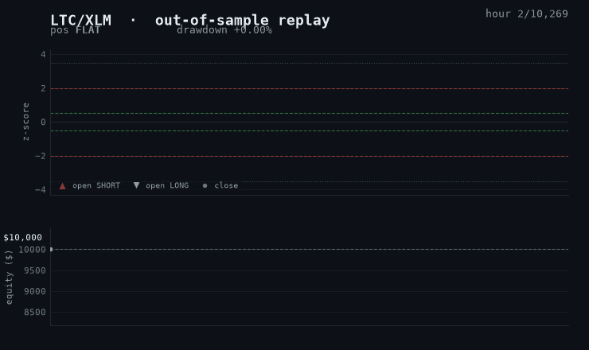
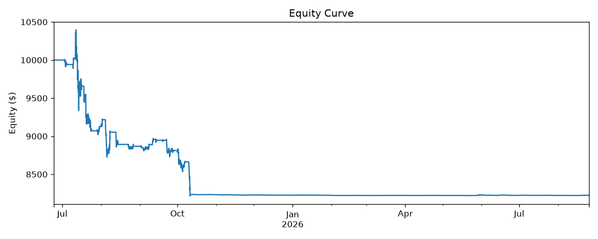
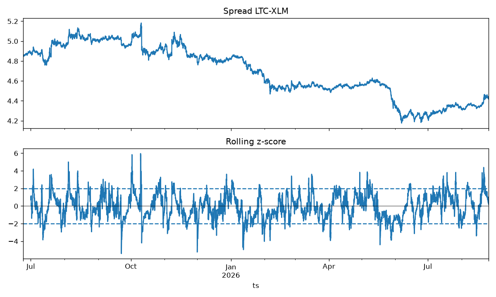

# Crypto Pairs-Trading Bot


This is a Python implementation of a pairs-trading strategy on crypto: it trades one cointegrated pair market-neutral, long one coin and short the other, betting that the spread between their prices reverts to its mean. The same `Strategy` + `RiskManager` + `PaperBroker` core drives both the backtest and the live paper feed, so the out-of-sample numbers below are the numbers a live run would trade. Pair selection and every parameter tune happen strictly in-sample, which makes the out-of-sample result a genuine forward estimate rather than a fit to the data. The strategy is not profitable out-of-sample. The point of the project is the pipeline, and every property it relies on is enforced by the test suite.

```
      Strategy + Risk (shared core)  ──  spread → z-score → signals
                 │
     ┌───────────┴───────────┐
  BACKTEST                 LIVE PAPER
 historical bars          polled hourly feed
     └──────── same PaperBroker (fees + slippage) ────────┘
```

Python 3.11+, a Typer CLI (`pairsbot`), paper-only.

## Watch it run



*A real out-of-sample backtest, played back hour by hour. Nothing staged.*

- **Top panel, the signal.** The z-score of the LTC/XLM spread: how far the two coins have drifted from their usual relationship (0 = normal). When it stretches past the ±2 bands, the bot bets they will converge and opens a trade (**▲** short, **▼** long, **○** close).
- **Bottom panel, the money.** Equity from a $10,000 start (red = underwater). It climbs to a $10,394 peak, then bleeds to **$8,223.62**. At −20% drawdown the risk kill-switch blocks new entries, so the bot sits out the rest of the sample flat.

Regenerate with `PYTHONPATH=src python scripts/make_replay_gif.py`.

## Results: in-sample vs out-of-sample

The headline result is a loss. Because pair selection and every parameter tune happen strictly in-sample, the figures below are a true out-of-sample holdout the strategy never saw.

On real Bitstamp hourly data (11 majors, from 2024-01-01), the screen freezes **LTC/XLM** (β = 0.2980, Engle-Granger cointegration p = 0.02166). The in-sample window is 12,960 bars, and out-of-sample is 10,269 bars.

| params          | in-sample                   | out-of-sample                           |
|-----------------|-----------------------------|-----------------------------------------|
| default         | (not tuned)                 | −17.76% return, Sharpe −2.15, 268 fills |
| tuned in-sample | +61.89% return, Sharpe 1.68 | −16.37% return, Sharpe −1.39, 68 fills  |



The default backtest ends at **$8,223.62** from a $10,000 start (max drawdown −20.97%, 268 fills).

The pattern is textbook overfitting. A configuration that looks stellar in-sample (+61.89%, Sharpe 1.68) loses out-of-sample (−16.37%); across the 144 parameter sets searched in-sample, the best barely beats the untuned default on the holdout. The grid fit noise, not signal, and that is only visible because selection and tuning never touch a single out-of-sample bar. Improving real performance would mean better pair and feature selection, not tuning harder against the past.

The selected p-value carries the same lesson. 0.02166 is the minimum across all 55 candidate pairs, so it is a data-snooped statistic: after a Šidák correction for 55 tests it is ≈ 0.70, which is not significant. The pair looked cointegrated in-sample largely by chance, which is consistent with it failing out-of-sample. The `screen` command prints this correction next to the raw p-value so the number is not read as more than it is.

## How it works

**The strategy.** Two coins whose log-price spread is cointegrated tend to mean-revert. The spread is `spread = log(A) − β·log(B)`, and the signal is a rolling z-score over `z_window = 168` bars:

- **Entry** when `z ≥ +2.0` (short the spread) or `z ≤ −2.0` (long the spread).
- **Exit** when `|z| ≤ exit_z = 0.5` (mean revert), `|z| ≥ stop_z = 3.5` (blow-out stop), or after `max_holding_bars = 168` (time stop).
- **Dollar-neutral** legs (gross/2 per side), so the book is market-neutral by construction.

Costs and limits: `gross_exposure_pct = 0.50`, `max_drawdown_pct = 0.20` (kill-switch), `fee_pct = 0.001`, `slippage_pct = 0.0005`, `starting_equity = $10,000`.



**The shared core.** One `PairsStrategy`, one `RiskManager`, and one `PaperBroker` drive both paths identically. The contract is `StrategyContext → list[Signal] → Orders → Fills`. The backtest feeds a historical DataFrame; live feeds an hourly `ccxt` poll of the last closed bar. The only differences are the price source and the sink (an in-memory report versus SQLite plus a printed monitor).

The layering is the point: the strategy decides which side, the risk manager decides how much (in USD notional) and enforces the drawdown gate, the broker decides at what price and with what costs, and the engine decides when (fills land at the next bar's open). Real-money execution (`LiveBroker`) is a deliberately disabled stub that raises `NotImplementedError`, so v1 is paper-only.

## Correctness

Every claim above rests on a structural property that is enforced by a test rather than trusted.

| Invariant | What it guarantees | Test |
|-----------|--------------------|------|
| **No-lookahead** | Bar `t` sees only `closes.iloc[:t+1]`, and orders fill at the *next* bar's open. Truncating future bars leaves the equity path up to `t` identical (atol 1e-9). | `tests/test_no_lookahead.py` |
| **In / out-of-sample split** | Pair and β are chosen on the training window only; an exact non-overlapping partition with in-sample preceding out-of-sample. | `tests/test_split.py`, `tests/test_cli_selection.py` |
| **Dollar-neutrality + kill-switch** | Entry legs net to zero, and the drawdown kill-switch blocks entries at ≥ `max_drawdown_pct`. | `tests/test_risk.py` |
| **Backtest = live parity** | Identical bars replayed through `Backtester` and `LiveRunner` produce identical trades and equity. (This caught a real regression during development.) | `tests/test_live_backtest_parity.py` |
| **Determinism** | The same config twice gives exactly equal final equity, more than zero trades, and `len(equity) == len(input)`. | `tests/test_backtest_golden.py` |
| **Restart-resume** | Resumes the prior run id, restores positions, cash, and state, keeps equity continuous, ignores post-flatten dust, and never double-enters. | `tests/test_live_runner.py` |
| **Network resilience** | Retries a flaky feed then succeeds, gives up with a clean error after 5 failed attempts, and raises on fewer than 2 bars. | `tests/test_live_feed.py` |

The no-lookahead check in `tests/test_no_lookahead.py` is a negative test: it builds an alternate future that diverges from bar `t+1` onward and asserts the z-score at bar `t` is exactly equal across the two futures.

```python
z_ref = current_zscore(_ctx(base.iloc[: t + 1]))

# Alternate world: identical up to and including bar t, wildly different after.
alt = base.copy()
future = alt.index[t + 1:]
alt.loc[future, "A"] = alt.loc[future, "A"].to_numpy() * (2.0 + rng.normal(0, 1.0, len(future)))
alt.loc[future, "B"] = alt.loc[future, "B"].to_numpy() * (0.5 + rng.normal(0, 1.0, len(future)))

# The z at bar t is identical regardless of the (differing) future.
z_alt = current_zscore(_ctx(alt.iloc[: t + 1]))
assert z_alt == z_ref
```

If any decision peeked at the future, this assertion would fail.

```
$ pytest -q
75 passed
```

## The CLI

Six subcommands, each taking `--config` (default `config.yaml`):

- `fetch-data` downloads and caches historical OHLCV for the whole universe.
- `screen` screens the in-sample window and freezes the winning pair to `selection.json`.
- `backtest` runs the frozen pair strictly out-of-sample and writes `reports/report.md` plus charts.
- `optimize` grid-searches parameters in-sample, then evaluates tuned versus default out-of-sample.
- `live` runs the paper-trading loop, resuming a prior run if one exists (Ctrl-C to stop).
- `status` prints the current book, risk, and PnL from the SQLite store.

## A real CLI transcript

`screen` freezes the pair, `live` resumes the prior paper run, and `status` reads the SQLite book.

```
$ pairsbot screen
Selected LTC/XLM  beta=0.2980  p=0.02166  (min over 55 pairs; Šidák-adjusted p≈0.70, not significant after correction)  (frozen to ./selection.json)

$ pairsbot live
Resuming live run #1 for LTC/XLM
06:00Z  eq $10,000  PnL $0 (+0.00%)  dd 0.00% (room 20.00% to 20% kill)  net $0  gross $0 (0.0%)  pos: flat

$ pairsbot status
── status · run #1 (live, LTC/XLM) · as of 2026-08-29 06:00 UTC ──
Positions (cost basis @ entry, not marked)
  (none)
Exposure @ entry   gross $0 (0.0%)   net $0 (0.0%)
Account            equity $10,000   PnL $0 (+0.00%) vs $10,000 start
Risk               peak $10,000   drawdown 0.00%   room 20.00% to 20% kill (kill equity $8,000)
Run summary        return +0.00%   Sharpe 0.00   max drawdown 0.00%   trades 0
```

## Quick start

```bash
python3 -m venv .venv && . .venv/bin/activate
pip install -e ".[dev]"
pytest                    # 75 tests
pairsbot fetch-data       # cache historical OHLCV
pairsbot screen           # screen in-sample and freeze the pair to selection.json
pairsbot backtest         # writes reports/report.md and charts
pairsbot optimize         # tune params in-sample, evaluate out-of-sample
pairsbot live             # live paper trading; resumes prior run (Ctrl-C to stop)
```

The pair is chosen once on the in-sample window and frozen to `selection.json`; `backtest`, `optimize`, and `live` all load that same frozen pair, so the backtest validates exactly what live trades. On startup `live` seeds its z-score window from the cache so it can trade immediately, and if a prior run for the pair exists it resumes, restoring open positions, cash, and strategy state so the equity curve stays continuous across restarts.

## Configuration

All knobs live in `config.yaml`: universe, exchange, quote, timeframe, `research` (`train_window_days = 540`, `p_threshold = 0.05`, `selection_path`), strategy z-thresholds, risk limits, costs, and account. The data source is any [`ccxt`](https://github.com/ccxt/ccxt) exchange: set `exchange:` (default `bitstamp`, chosen because it serves deep hourly history and is reachable without a VPN). Historical OHLCV is cached as parquet in `data_cache/`.

**Tech stack:** pandas · numpy · statsmodels (Engle-Granger cointegration and OLS hedge ratio) · ccxt (Bitstamp) · typer · matplotlib · pyarrow · PyYAML · SQLite (stdlib). Entry point `pairsbot = pairsbot.cli:app`, `src/` layout package `pairsbot`.

## Limitations

- **Paper-only.** `LiveBroker`, the real-execution seam, raises `NotImplementedError` and is never instantiated, and ccxt is used read-only for market data. There are no API keys and no order placement.
- **The kill-switch is entry-blocking only.** Once drawdown reaches `max_drawdown_pct` it stops new entries, but it does not force-liquidate an open position, which closes only on a normal strategy exit.
- **One pair, one timeframe, one exchange, one period.** The result is a single cointegrated pair on hourly Bitstamp data over one window. It demonstrates the pipeline, not a general claim about pairs trading.
- **Multiple-testing is reported, not corrected for in selection.** The screen still picks the lowest raw p-value; the Šidák-adjusted figure is printed alongside it, but it does not change which pair is chosen.
- **Simple fill model.** Fills land at the next bar's open with a fixed fee and a fixed adverse-slippage haircut. There is no order-book depth, no partial fills, no latency, and no funding.
